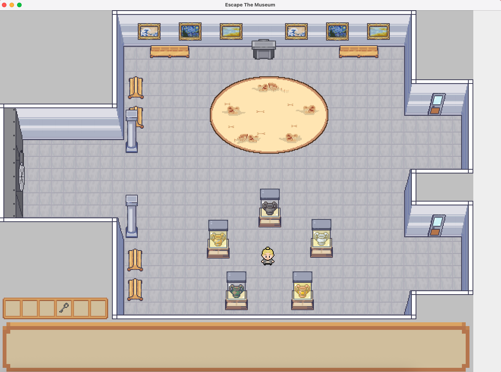
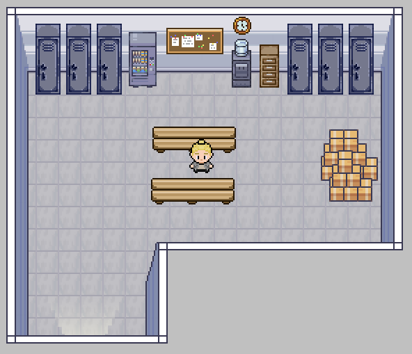
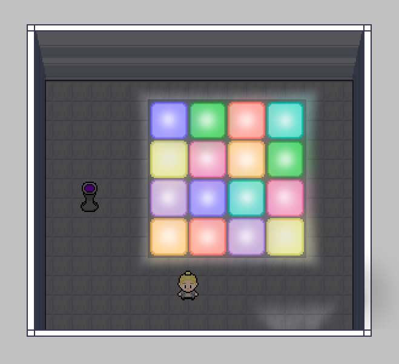
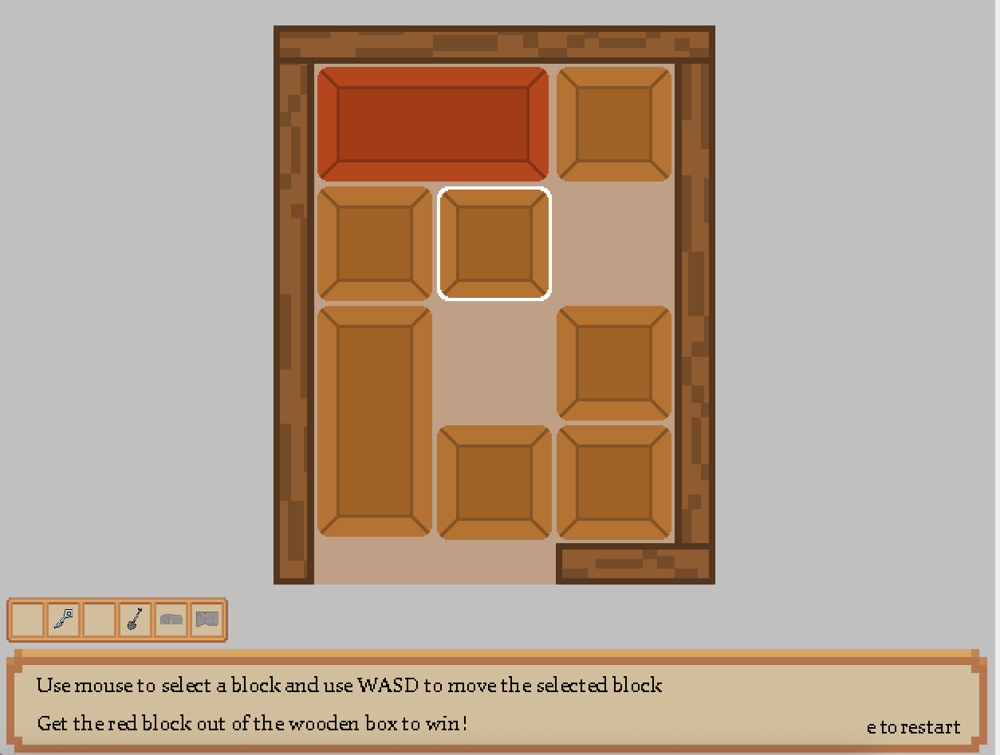
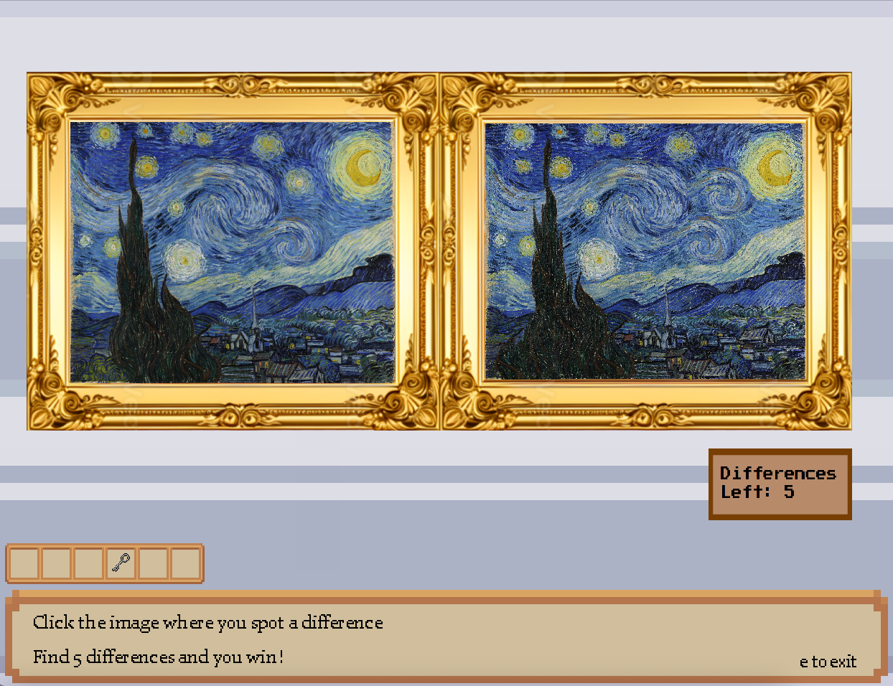
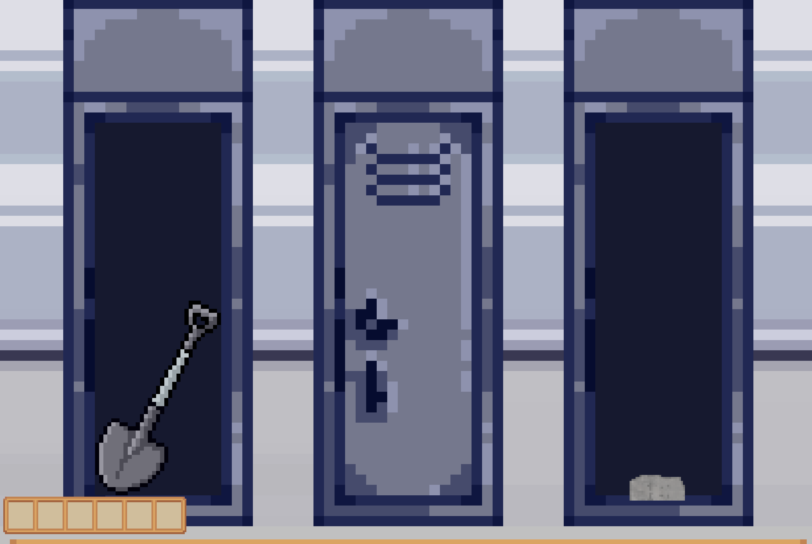
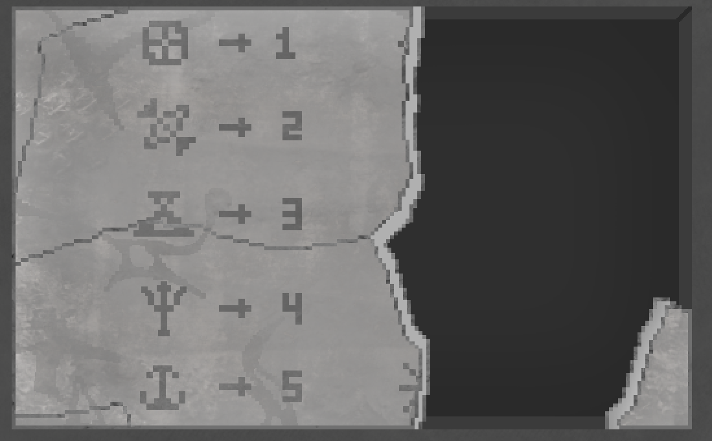
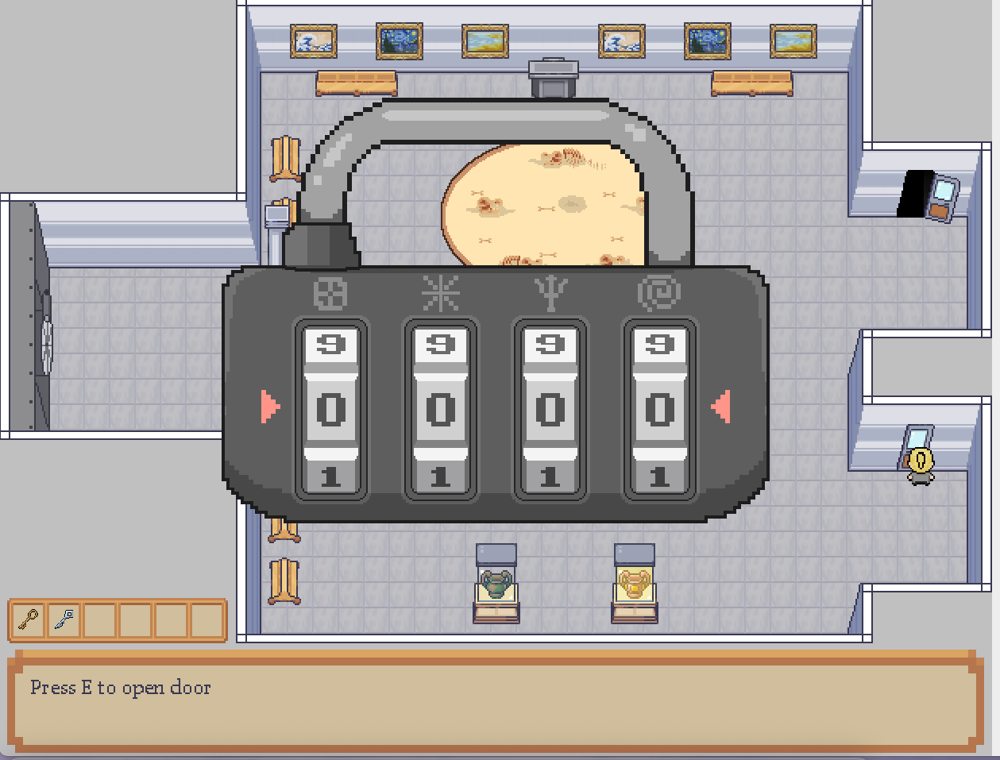
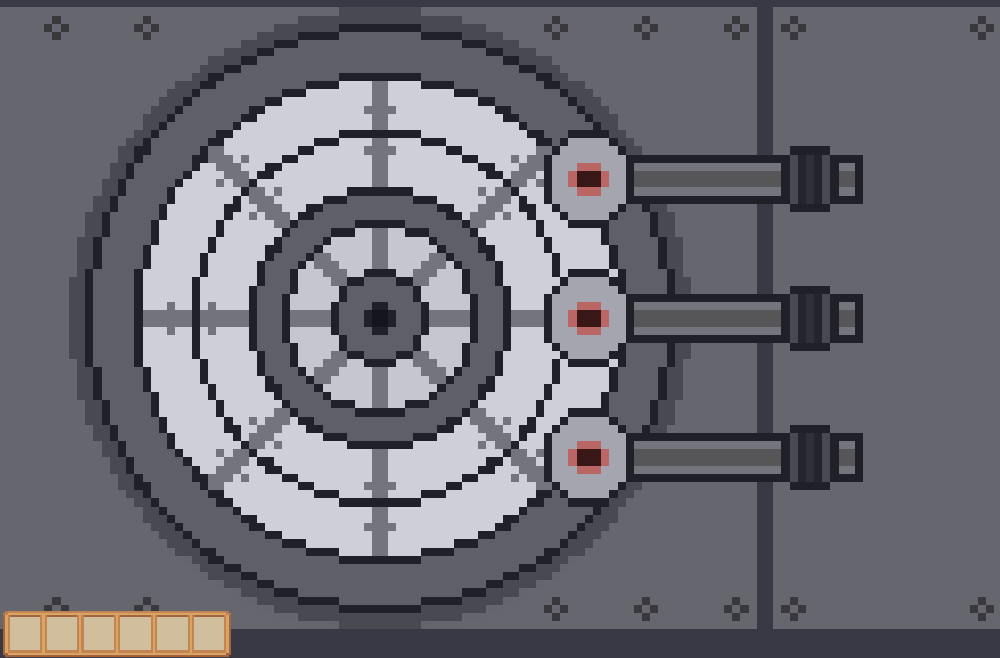

# Escape the Museum – Java Puzzle Game

A Java-based 2D escape room game developed as a three-person team project for a Grade 12 Computer Science course. Players explore a museum, interact with objects, solve puzzles, collect keys, and unlock new areas in order to escape.

> **Note:** This repository preserves an academic team project that was originally developed outside of Git. The repository was created after development, so it does not contain the project's original commit history.

---

## Overview

**Escape the Museum** is a puzzle-based adventure game where players navigate through a museum, inspect objects, complete interactive mini-games, and discover clues to unlock new rooms.

The game focuses on exploration, logical problem-solving, and object interaction while demonstrating object-oriented programming, event-driven design, and modular software development.

The project was developed collaboratively by a team of three students, with contributions across gameplay programming, puzzle design, graphics, documentation, and overall game design.

---

## Features

- 2D Java-based adventure game
- Player movement and room exploration
- Interactive objects that can be inspected, collected, and placed
- Inventory system for storing and using items
- Multiple rooms with locked areas and progression mechanics
- Event-driven object interactions
- Custom puzzle systems including:
  - Spot the Difference
  - Memory Puzzle
  - Sliding Block Puzzle
- Puzzle progression integrated into the overall gameplay loop
- Custom artwork and game assets

---

## Technologies

- Java
- Java Swing
- Object-Oriented Programming (OOP)

---

## Technical Highlights

- Designed the project using object-oriented programming principles
- Implemented interactive objects that could be inspected, collected, stored in an inventory, and placed to solve puzzles
- Managed game states, room transitions, and puzzle progression
- Developed multiple custom puzzle systems integrated into the main gameplay loop
- Applied modular design to separate gameplay systems, puzzles, and user interactions
- Created software design documentation using UML and use case diagrams

---

## My Contributions

My primary responsibilities focused on gameplay programming, puzzle implementation, and system design.

My contributions included:

- Designed and implemented the **Spot the Difference** puzzle
- Designed and implemented the **Memory Puzzle**
- Developed lock and key progression mechanics
- Implemented interactive gameplay elements and object interactions
- Contributed to game design decisions and graphical assets
- Created UML and Use Case diagrams documenting the system architecture and gameplay flow
- Contributed to the Game Design Document and overall project planning

---

## Team Project

This project was completed as a collaborative three-person team project.

Responsibilities were shared across:

- Gameplay programming
- Puzzle development
- Graphics and visual assets
- Documentation
- Overall game design

---

# Setup Instructions

## Requirements

Before running the game, make sure you have:

- Java Development Kit (JDK) 17 or newer installed

Check your Java installation:

```bash
java -version
```

---

## Download the Project

1. Download the ZIP file from GitHub.
2. Extract the folder.
3. Open a terminal and navigate into the project folder:

```bash
cd Escape-the-Museum-Game-main
```

The project directory should contain folders such as:

```
src/
Backgrounds/
Decoration/
Pedestals/
Items/
Keys/
```

**Important:** Do not move or rename the asset folders. The game loads images and resources using their existing folder structure.

---

## Compile the Game

From the main project directory, compile all Java source files:

```bash
javac -d . src/*.java
```

This creates the required `.class` files needed to run the game.

---

## Run the Game

After compiling, launch the game with:

```bash
java EscapeRoom
```

The game window should open and be ready to play.

---

## Troubleshooting

### Images are not loading

!!!This project was originally developed on Windows, where file paths commonly use backslashes (`\`). Image paths will need to use forward slashes (`/`) when running on macOS or Linux.

Make sure the game is being run from the main project folder.

Correct:

```bash
cd Escape-the-Museum-Game-main
java EscapeRoom
```

Incorrect:

```bash
cd src
java EscapeRoom
```

The game requires the asset folders (`Backgrounds`, `Decoration`, `Pedestals`, `Items`, etc.) to remain in their original locations.

---

### Game does not start

Try recompiling the project:

```bash
javac -d . src/*.java
java EscapeRoom
```

---

# Controls

| Action | Control |
|--------|---------|
| Move | **W A S D** |
| Interact | **E** |
| Pick up / Select Objects | **Mouse** |

> If the game window appears slightly too small, resize the window to display the full game area.

---

# Documentation

Additional project documentation is available in the Game Documentation file

---

# Screenshots

## Main Room

 

## Locker Room



## Memory Puzzle Room



## Sliding Block Puzzle



## Spot the Difference Puzzle



## Inside Locker



## Decoder

 

## Door Lock

 

## Vault

 


